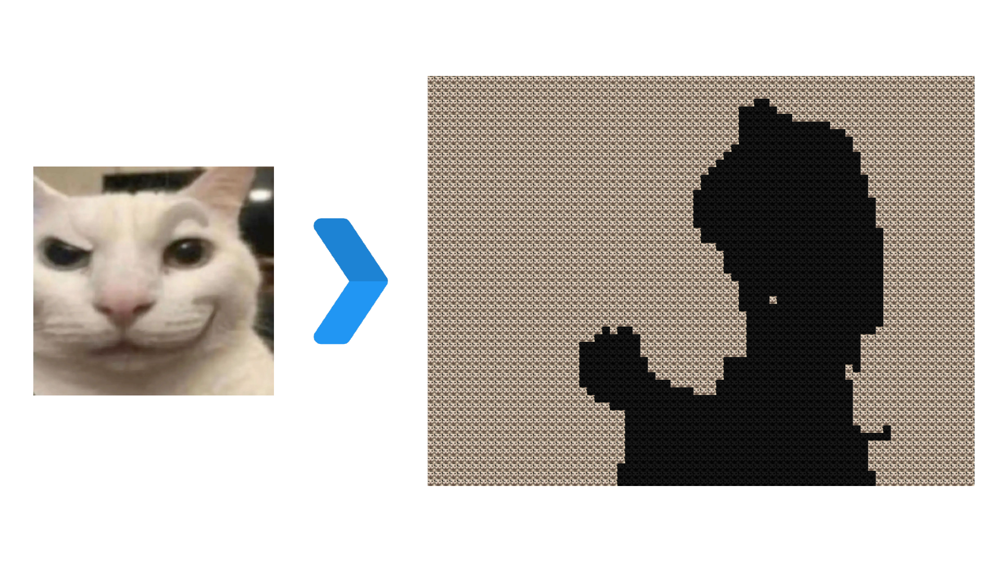

<a id="readme-top"></a>

[![Contributors][contributors-shield]][contributors-url]
[![Forks][forks-shield]][forks-url]
[![Stargazers][stars-shield]][stars-url]
[![Issues][issues-shield]][issues-url]
[![MIT License][license-shield]][license-url]
[![LinkedIn][linkedin-shield]][linkedin-url]


<!-- PROJECT LOGO -->
<br />
<div align="center">
  <a href="https://github.com/JerryTYan/bad-apple-mosaic">
    
  </a>

<h3 align="center">Bad Appleify</h3>

  <p align="center">
    🍎 Transform any image into a Bad Apple mosaic video! 🎥🖼️
    <br />
    <br />
    <a href="https://github.com/JerryTYan/bad-apple-mosaic">View Demo</a>
    ·
    <a href="https://github.com/JerryTYan/bad-apple-mosaic/issues/new?labels=bug&template=bug-report---.md">Report Bug</a>
    ·
    <a href="https://github.com/JerryTYan/bad-apple-mosaic/issues/new?labels=enhancement&template=feature-request---.md">Request Feature</a>
  </p>
</div>


<!-- TABLE OF CONTENTS -->
<details>
  <summary>Table of Contents</summary>
  <ol>
    <li>
      <a href="#about-the-project">About The Project</a>
      <ul>
        <li><a href="#built-with">Built With</a></li>
      </ul>
    </li>
    <li>
      <a href="#getting-started">Getting Started</a>
      <ul>
        <li><a href="#prerequisites">Prerequisites</a></li>
        <li><a href="#installation">Installation</a></li>
      </ul>
    </li>
    <li><a href="#usage">Usage</a></li>
    <li><a href="#roadmap">Roadmap</a></li>
    <li><a href="#contributing">Contributing</a></li>
    <li><a href="#license">License</a></li>
    <li><a href="#contact">Contact</a></li>
    <li><a href="#acknowledgments">Acknowledgments</a></li>
  </ol>
</details>


<!-- ABOUT THE PROJECT -->
## About The Project
<div align="center">
  
</div>

Bad Appleify is a generative video tool that transforms any image into a "Bad Apple" mosaic video. The project takes inspiration from the iconic "Bad Apple" video, where each frame is a mosaic made up of the user-uploaded image. The black pixels of the original video are replaced with a darkened version of the image, while the white pixels remain as the original image. The image above shows this process. This project allows users to upload any image and convert it into a mosaic video of "Bad Apple".

<p align="right">(<a href="#readme-top">back to top</a>)</p>

### Built With

* [![Python][Python]][Python-url]
* [![CustomTkinter][CustomTkinter]][CustomTkinter-url]
* [![FFmpeg][FFmpeg]][FFmpeg-url]
* [![Pillow][Pillow]][Pillow-url]
* [![OpenCV][OpenCV]][OpenCV-url]

<p align="right">(<a href="#readme-top">back to top</a>)</p>

<!-- GETTING STARTED -->
## Getting Started

This section will guide you through setting up Bad Appleify on your local machine. You can either run the project from the source code or use the pre-built executable.

### Prerequisites

- Python 3.6
- [FFmpeg](https://ffmpeg.org/download.html) (included with the exe)

To install required dependencies, run:
```sh
pip install -r requirements.txt
```

### Installation

1. Clone the repository:
   ```sh
   git clone https://github.com/JerryTYan/bad-apple-mosaic.git
   ```

2. Navigate to the project directory:
   ```sh
   cd bad-apple-mosaic/bad_apple_mosaic
   ```

3. Run the application:
   ```sh
   python gui.py
   ```

If you are using the executable:

1. Download and run `BadAppleifyInstaller.exe`, or
2. Unpack the source and run `BadAppleify.exe`.

<p align="right">(<a href="#readme-top">back to top</a>)</p>

<!-- USAGE EXAMPLES -->
## Usage


<br />

To create your own Bad Apple mosaic video:

1. Select an image of your choice.
2. Choose the desired frame rate (30fps or 60fps).
3. Click "Upload" to process your video.
4. Once the video is generated, click "Save As" to save it to your preferred location.

Please note that this program is CPU intensive and may take several minutes to complete generating the final video.

<p align="right">(<a href="#readme-top">back to top</a>)</p>

<!-- ROADMAP -->
## Roadmap

- [x] User image upload functionality
- [x] Video generation from frames
- [ ] Adding input and output resolution options (36p & 2K, 1080p)
- [ ] Improved error handling and progress feedback
- [ ] Optimizations for larger image sizes and faster video processing

See the [open issues](https://github.com/JerryTYan/bad-apple-mosaic/issues) for a full list of proposed features (and known issues).

<p align="right">(<a href="#readme-top">back to top</a>)</p>

<!-- CONTRIBUTING -->
## Contributing

Contributions are what make the open source community such an amazing place to learn, inspire, and create. Any contributions you make are **greatly appreciated**.

If you have a suggestion that would improve this project, please fork the repo and create a pull request. You can also simply open an issue with the tag "enhancement". Don't forget to give the project a star! Thanks again!

1. Fork the Project
2. Create your Feature Branch (`git checkout -b feature/AmazingFeature`)
3. Commit your Changes (`git commit -m 'Add some AmazingFeature'`)
4. Push to the Branch (`git push origin feature/AmazingFeature`)
5. Open a Pull Request

### Top contributors:

<a href="https://github.com/JerryTYan/bad-apple-mosaic/graphs/contributors">
  
</a>

<p align="right">(<a href="#readme-top">back to top</a>)</p>

<!-- LICENSE -->
## License

Distributed under the MIT License. See `LICENSE.txt` for more information.

<p align="right">(<a href="#readme-top">back to top</a>)</p>

<!-- CONTACT -->
## Contact

Project Link: [https://github.com/JerryTYan/bad-apple-mosaic](https://github.com/JerryTYan/bad-apple-mosaic)

<p align="right">(<a href="#readme-top">back to top</a>)</p>

<!-- ACKNOWLEDGMENTS -->
## Acknowledgments

- Inspired by the original "Bad Apple" video.
- Thanks to the developers of the libraries used in this project.
- Special thanks to the open-source community for guidance and tools.

<p align="right">(<a href="#readme-top">back to top</a>)</p>


<!-- MARKDOWN LINKS & IMAGES -->
[contributors-shield]: https://img.shields.io/github/contributors/JerryTYan/bad-apple-mosaic.svg?style=for-the-badge
[contributors-url]: https://github.com/JerryTYan/bad-apple-mosaic/graphs/contributors
[forks-shield]: https://img.shields.io/github/forks/JerryTYan/bad-apple-mosaic.svg?style=for-the-badge
[forks-url]: https://github.com/JerryTYan/bad-apple-mosaic/network/members
[stars-shield]: https://img.shields.io/github/stars/JerryTYan/bad-apple-mosaic.svg?style=for-the-badge
[stars-url]: https://github.com/JerryTYan/bad-apple-mosaic/stargazers
[issues-shield]: https://img.shields.io/github/issues/JerryTYan/bad-apple-mosaic.svg?style=for-the-badge
[issues-url]: https://github.com/JerryTYan/bad-apple-mosaic/issues
[license-shield]: https://img.shields.io/github/license/JerryTYan/bad-apple-mosaic.svg?style=for-the-badge
[license-url]: https://github.com/JerryTYan/bad-apple-mosaic/blob/main/LICENSE
[linkedin-shield]: https://img.shields.io/badge/-LinkedIn-black.svg?style=for-the-badge&logo=linkedin&colorB=555
[linkedin-url]: https://www.linkedin.com/in/jerry-yan
[product-screenshot]: assets/gui_screenshot.png

[Python]: https://img.shields.io/badge/Python-3776AB?style=for-the-badge&logo=python&logoColor=white
[Python-url]: https://www.python.org/
[CustomTkinter]: https://img.shields.io/badge/CustomTkinter-009688?style=for-the-badge&logo=github&logoColor=white
[CustomTkinter-url]: https://github.com/TomSchimansky/CustomTkinter
[FFmpeg]: https://img.shields.io/badge/FFmpeg-007808?style=for-the-badge&logo=ffmpeg&logoColor=white
[FFmpeg-url]: https://ffmpeg.org/
[Pillow]: https://img.shields.io/badge/Pillow-569A31?style=for-the-badge&logo=python&logoColor=white
[Pillow-url]: https://python-pillow.org/
[OpenCV]: https://img.shields.io/badge/OpenCV-5C3EE8?style=for-the-badge&logo=opencv&logoColor=white
[OpenCV-url]: https://opencv.org/
